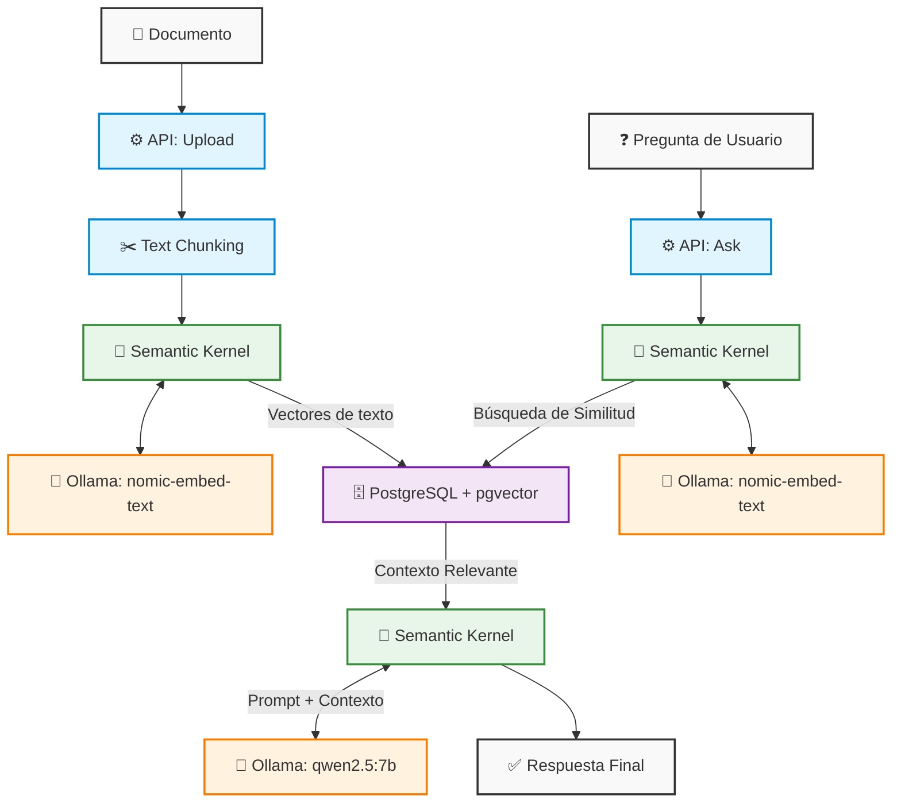

# NexFlow.Knowledge


## 📌 Visión General y Propósito

**NexFlow.Knowledge** es un servicio backend de alto rendimiento diseñado para implementar sistemas **RAG (Retrieval-Augmented Generation)** utilizando **.NET 10** y **C#**. 

Este proyecto establece un núcleo robusto para la comprensión, procesamiento y recuperación de conocimiento a partir de documentos. Destaca por utilizar **Semantic Kernel** como orquestador cognitivo y **PostgreSQL + pgvector** para la persistencia y búsqueda vectorial de alta eficiencia.

**Enfoque Actual:** La arquitectura está diseñada para operar con inferencia y generación de *embeddings* **100% de manera local y soberana mediante Ollama**. Esto permite mantener total privacidad de los datos, evitar costos de API externas y minimizar latencias en entornos controlados (On-Premise).

---

## 🏗️ Arquitectura y Roadmap Multiprovedor

La solución sigue principios estrictos de **Clean Architecture**, **DDD** (Domain-Driven Design) y **CQRS** (mediante MediatR). Esta separación de conceptos garantiza que el core de la aplicación sea agnóstico a la infraestructura.

Aunque el enfoque actual es una **infraestructura 100% local con Ollama**, el diseño está preparado para soportar configuraciones *multiprovedor* (como Azure OpenAI u OpenAI estándar). Cambiar de proveedor de IA requiere únicamente modificar la configuración de infraestructura, sin afectar el dominio de la aplicación ni los casos de uso.

### Flujo de RAG (Ingesta y Consulta)



---

## 🚀 Cómo Ejecutar el Proyecto (Getting Started)

### Requisitos Previos
- [.NET 10 SDK](https://dotnet.microsoft.com/download/dotnet/10.0)
- Docker y Docker Compose
- [Ollama](https://ollama.ai/) instalado y en ejecución localmente (`ollama serve`).

### Paso 1: Descargar los Modelos en Ollama
El proyecto por defecto utiliza `nomic-embed-text` para los *embeddings* (por su eficiencia y optimización semántica) y `qwen2.5:7b` para el LLM de chat. Ejecuta los siguientes comandos en tu terminal para instalarlos:

```bash
ollama pull nomic-embed-text
ollama pull qwen2.5:7b
```

### Paso 2: Configuración (`appsettings.json`)
Verifica tu configuración en `NexFlow.Knowledge.Api/appsettings.json`. Dependiendo de tu entorno de ejecución (Docker o .NET CLI local), el `BaseUrl` de Ollama y la base de datos deben apuntar a la dirección correcta:

```json
{
  "ConnectionStrings": {
    "DefaultConnection": "Host=localhost;Port=5432;Database=nexflowknowledge;Username=nexflow;Password=NexFlow2026!"
  },
  "Ollama": {
    "BaseUrl": "http://localhost:11434",
    "ChatModel": "qwen2.5:7b",
    "EmbeddingModel": "nomic-embed-text"
  },
  "Knowledge": {
    "RetrievalLimit": 10,
    "ContextLimit": 5,
    "SimilarityThreshold": 0.65
  }
}
```
> **Nota para Docker:** Si corres la API en Docker, el `docker-compose.yml` sobrescribe estas variables (ej. `Host=postgres` para DB y `http://ollama:11434` para Ollama).

### Paso 3: Despliegue con Docker
Para desplegar toda la infraestructura (API, PostgreSQL con pgvector y un contenedor de Ollama), ejecuta desde la raíz del proyecto:

```bash
docker-compose up -d --build
```

### Paso 4: Ejecución Local (.NET CLI)
Si prefieres ejecutar la API directamente desde tu entorno de desarrollo para poder iterar (requiere instancias locales de PostgreSQL y Ollama):

```bash
cd NexFlow.Knowledge.Api
dotnet run
```

### Paso 5: Pruebas y Health Check

Puedes usar los siguientes comandos `curl` para probar el flujo completo:

**1. Subir un documento (Ingesta):**
```bash
curl -X POST "http://localhost:8080/api/documents/upload" \
  -H "accept: text/plain" \
  -H "Content-Type: multipart/form-data" \
  -F "file=@/ruta/local/hacia/tu/documento.txt"
```

**2. Hacer una pregunta (RAG Consulta):**
```bash
curl -X POST "http://localhost:8080/api/knowledge/ask" \
  -H "accept: text/plain" \
  -H "Content-Type: application/json" \
  -d '{
  "question": "¿De qué trata el documento que acabo de subir?"
}'
```
*(Puedes acceder a la interfaz de Swagger UI ingresando a `http://localhost:8080/swagger` en tu navegador cuando la API esté corriendo).*